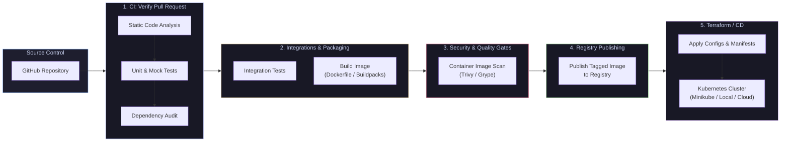

healthch-java

basic health checker (Spring Boot Actuator endpoint) application with full CI/CD pipeline

```mermaid

flowchart LR
    %% Node Definitions
    subgraph VCS["Source Control"]
        Repo["GitHub Repository"]
    end

    subgraph Phase1["1. CI: Verify Pull Request"]
        SCA["Static Code Analysis"]
        Tests["Unit & Mock Tests"]
        DepAudit["Dependency Audit"]

        SCA --> Tests
        Tests --> DepAudit
    end

    subgraph Phase2["2. Integrations & Packaging"]
        Integration["Integration Tests"]
        DockerBuild["Build Image\n(Dockerfile / Buildpacks)"]
    end

    subgraph Phase3["3. Security & Quality Gates"]
        ImageScan["Container Image Scan\n(Trivy / Grype)"]
    end

    subgraph Phase4["4. Registry Publishing"]
        Publish["Publish Tagged Image\nto Registry"]
    end

    subgraph Phase5["5. Terraform / CD"]
        Terraform["Apply Configs & Manifests"]
        K8sCluster["Kubernetes Cluster\n(Minikube / Local / Cloud)"]

        Terraform --> K8sCluster
    end

    %% Flow Connections
    Repo --> Phase1
    Phase1 --> Phase2
    Phase2 --> Phase3
    Phase3 --> Phase4
    Phase4 --> Phase5

    %% Styling
    style VCS fill:#1e1e2e,stroke:#89b4fa,color:#cdd6f4
    style Phase1 fill:#181825,stroke:#b4befe,color:#cdd6f4
    style Phase2 fill:#181825,stroke:#f9e2af,color:#cdd6f4
    style Phase3 fill:#181825,stroke:#f38ba8,color:#cdd6f4
    style Phase4 fill:#181825,stroke:#a6e3a1,color:#cdd6f4
    style Phase5 fill:#181825,stroke:#cba6f7,color:#cdd6f4

```

